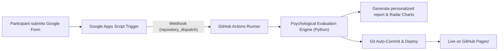

# MindPulse (Psyche-Reports)
### Psychological Welfare Assessment Platform | Community Engagement Project (CEP)

[](https://pages.github.com/)
[](https://docs.google.com)
[](LICENSE)

**MindPulse** is an automated psychological welfare evaluation and self-reflection platform developed for Community Engagement Projects (CEP). It captures survey responses from a **Google Form**, runs them through a multidimensional psychological scoring engine, and generates personalized, interactive static HTML reports published directly to **GitHub Pages**.

---

## Project Links
- **Google Form (Assessment Survey)**: [Take the Psychological Evaluation](https://docs.google.com/forms/d/e/1FAIpQLSeHTq7AJaWnuY1S7jnSrSzAU9U6klFItG0h-KqO-3gWt44p7g/viewform)
- **Edit Form Link**: [Form Editor](https://docs.google.com/forms/d/1nnzr6fL0V3Wv13q-yuWzAnY29lC-CdW4HG6VnvHo35k/edit)
- **Live Platform**: [https://adionpluto.github.io/MindPulse/](https://adionpluto.github.io/MindPulse/)

---

## How The Automation Works



1. **Data Collection**: A participant fills out the Google Form (Name, Age, Gender, and Welfare questions).
2. **Instant Trigger**: Google Apps Script catches the `On Form Submit` event.
3. **Webhook Dispatch**: The script dispatches the answers to GitHub Actions via `repository_dispatch`.
4. **Scoring Engine**: `automation/process_responses.py` computes:
   - **Stress & Overwhelm Index** (0 - 100%) with categorized load levels.
   - **Emotional Resilience & Mood Stability** (0 - 100%).
   - **Vitality, Focus & Sleep Restoration** (0 - 100%).
   - **Coping Adaptability & Problem-Solving** (0 - 100%).
   - **Social Anchoring & Community Connectivity** (0 - 100%).
   - **Psychological Personas** (e.g., *The Resilient Anchor*, *The High-Functioning Overachiever*, *The Overwhelmed Navigator*).
   - **Tailored 3-Phase Action Roadmap** (Immediate Relief, Short-Term Habit, Sustainable Growth).
5. **Report Generation**: A mobile-responsive HTML report is compiled with interactive **Chart.js** radar charts and stress gauges under the participant's name (e.g. `reports/aditya-choubey.html`).
6. **Auto-Publishing**: GitHub Actions commits the report and publishes it live to GitHub Pages.

---

## Repository Structure

```text
psyche-reports/
.github/
workflows/
generate-reports.yml           # GitHub Actions automated workflow
automation/
google_apps_script.js          # Google Apps Script trigger (copy to Form/Sheet)
sample_responses.json          # Test fixture responses with demographics
process_responses.py           # Core psychological evaluation & HTML engine
data/
responses.json                 # Persistent responses database (JSON)
scoring_config.json            # Configurable assessment rubric & scoring rules
templates/
report_template.html           # Participant report template with Chart.js
index_template.html            # Main project portal & cohort stats
reports/                       # Output directory for individual reports
aditya-choubey.html
sarah-jenkins.html
marcus-vance.html
elena-rostova.html
index.html                     # Live landing page & CEP aggregate overview
README.md                      # Project documentation
```

---

## Setup Guide

### 1. Enable GitHub Pages
1. Go to repository **Settings** -> **Pages**.
2. Under **Build and deployment** -> **Source**, select **Deploy from a branch**.
3. Choose branch `main` and folder `/ (root)` and click **Save**.

### 2. Configure Google Apps Script in your Google Form
1. Open your [Google Form](https://docs.google.com/forms/d/1nnzr6fL0V3Wv13q-yuWzAnY29lC-CdW4HG6VnvHo35k/edit).
2. Click the three dots -> **Script editor**.
3. Paste the contents of `automation/google_apps_script.js`.
4. Click **Triggers (clock icon)** -> **+ Add Trigger**:
   - Choose function: `onFormSubmit`
   - Select event type: `On form submit`
   - Click **Save**.

---

## Psychological Assessment Methodology & Dimensions

The evaluation engine maps answers to 5 core psychological dimensions:

| Dimension | Description | Target / Benchmark |
| :--- | :--- | :---: |
| **Stress & Overwhelm** | Acute cognitive tension, perceived lack of control, and deadline pressure. | < 45% (Lower is calmer) |
| **Emotional Resilience** | Emotional stability, optimism, self-efficacy, and adaptive mood recovery. | > 65% |
| **Vitality & Focus** | Restorative sleep, daily physical stamina, and concentration retention. | > 60% |
| **Coping Adaptability** | Constructive problem-solving, mindfulness, and healthy habits. | > 55% |
| **Social Anchoring** | Perceived support from peers, mentors, and community belonging. | > 58% |

---

## Privacy, Anonymity & Ethical Welfare Notice

- **Privacy**: Participant identities are processed securely to generate individualized development insights.
- **Educational Scope**: MindPulse is designed for Community Engagement Projects (CEP), personal self-reflection, and wellness promotion. It does not provide clinical diagnoses.
- **Crisis Support**: Every report features accessible, 24/7 confidential crisis helplines (US 988, KIRAN India 1800-599-0019, Tele-MANAS 14416, Samaritans UK 116 123, and Global directories).

---

## License
This project is open-source and available under the [MIT License](LICENSE).
