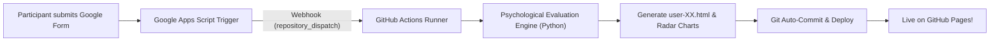

# MindPulse (Psyche-Reports)
### Psychological Welfare Assessment Platform | Community Engagement Project (CEP)

[](https://pages.github.com/)
[](https://docs.google.com)
[](LICENSE)

**MindPulse** is an automated psychological welfare evaluation and self-reflection platform developed for Community Engagement Projects (CEP). It seamlessly captures survey responses from a **Google Form**, runs them through a multidimensional psychological scoring engine, and generates personalized, interactive static HTML reports published directly to **GitHub Pages**.

---

## Project Links
- **Google Form (Assessment Survey)**: [Take the Psychological Evaluation](https://docs.google.com/forms/d/e/1FAIpQLSeHTq7AJaWnuY1S7jnSrSzAU9U6klFItG0h-KqO-3gWt44p7g/viewform)
- **Edit Form Link**: [Form Editor](https://docs.google.com/forms/d/1nnzr6fL0V3Wv13q-yuWzAnY29lC-CdW4HG6VnvHo35k/edit)
- **Assessment Report**: [Website](https://adionpluto.github.io/MindPulse/)

---

## How The Automation Works



1. **Data Collection**: A participant fills out the Google Form.
2. **Instant Trigger**: Google Apps Script catches the `On Form Submit` event.
3. **Webhook Dispatch**: The script sends the answers to GitHub Actions via `repository_dispatch`.
4. **Scoring Engine**: `automation/process_responses.py` computes:
   - **Stress & Overwhelm Index** (0/100%) with categorized load levels.
   - **Emotional Resilience & Mood Stability** (0/100%).
   - **Vitality, Focus & Sleep Restoration** (0/100%).
   - **Coping Adaptability & Problem-Solving** (0/100%).
   - **Social Anchoring & Community Connectivity** (0/100%).
   - **Psychological Personas** (e.g., *The Resilient Anchor*, *The High-Functioning Overachiever*, *The Overwhelmed Navigator*).
   - **Tailored 3-Phase Action Roadmap** (Immediate Relief, Short-Term Habit, Sustainable Growth).
5. **Report Generation**: A mobile-responsive HTML report (`reports/user-XX.html` & `user-XX.html`) is compiled with interactive **Chart.js** radar charts and stress gauges.
6. **Auto-Publishing**: GitHub Actions commits the report and publishes it live to GitHub Pages.

---

## Repository Structure

```
psyche-reports/
.github/
   workflows/
generate-reports.yml           # GitHub Actions automated workflow
automation/
google_apps_script.js          # Google Apps Script trigger (copy to Form/Sheet)
sample_responses.json          # Mock test fixture responses
process_responses.py           # Core psychological evaluation & HTML engine
data/
responses.json                 # Persistent responses database (JSON)
scoring_config.json            # Configurable assessment rubric & scoring rules
templates/
report_template.html           # Participant report template with Chart.js
index_template.html            # Main project portal & cohort stats
reports/                       # Output directory for individual reports
user-01.html
user-02.html
user-03.html
user-04.html
index.html                     # Live landing page & CEP aggregate overview
README.md                      # Project documentation
```

---

## Step-by-Step Setup Guide

### 1. Push Repository to GitHub
1. Create a new repository on GitHub named `psyche-reports`.
2. Push this project code to your GitHub repository:
   ```bash
   git init
   git add .
   git commit -m "Initial commit of MindPulse Psyche-Reports platform"
   git branch -M main
   git remote add origin https://github.com/<YOUR_USERNAME>/psyche-reports.git
   git push -u origin main
   ```

### 2. Enable GitHub Pages
1. On GitHub, go to your repository **Settings** **Pages**.
2. Under **Build and deployment**  **Source**, select **Deploy from a branch**.
3. Choose branch `main` and folder `/ (root)`.
4. Click **Save**. Your website will be live at: `https://<YOUR_USERNAME>.github.io/psyche-reports/`

### 3. Generate a GitHub Personal Access Token (PAT)
Google Apps Script needs permission to trigger GitHub Actions:
1. Go to your GitHub **Settings** **Developer settings** **Personal access tokens** **Tokens (classic)**.
2. Click **Generate new token (classic)**.
3. Name it `MindPulse-GAS-Trigger` and check the **`repo`** scope (or `workflow`).
4. Click **Generate token** and copy the token string (`ghp_...`).

### 4. Configure Google Apps Script in your Google Form
1. Open your [Google Form](https://docs.google.com/forms/d/1nnzr6fL0V3Wv13q-yuWzAnY29lC-CdW4HG6VnvHo35k/edit) (or its linked Google Sheet).
2. Click the **three vertical dots (:)** in the top-right corner **Script editor** (or **Extensions** **Apps Script** if in Google Sheets).
3. Open `Code.gs`, erase any existing code, and paste the entire contents of [`automation/google_apps_script.js`](automation/google_apps_script.js).
4. Update the `CONFIG` values:
   ```javascript
   const CONFIG = {
     GITHUB_OWNER: "YOUR_GITHUB_USERNAME", // e.g. "alex123"
     GITHUB_REPO: "psyche-reports",        // your repo name
     GITHUB_TOKEN: "ghp_yourCopiedToken",  // your PAT token
     COHORT: "CEP Cohort 2026"
   };
   ```
5. Set the trigger:
   - Click the **Triggers (clock icon )** on the left sidebar.
   - Click **+ Add Trigger** (bottom right).
   - **Choose which function to run**: `onFormSubmit`
   - **Select event source**: `From form` (or `From spreadsheet`)
   - **Select event type**: `On form submit`
   - Click **Save** and grant permissions when prompted.

**That is all!** Whenever a participant submits your Google Form, their assessment report will be automatically generated, scored, and published to GitHub Pages within ~30 seconds!

---

## Local Testing & Manual Rebuilds

To test or generate reports locally on your machine:
```bash
# Run assessment engine on existing data/responses.json
python automation/process_responses.py

# Test with a custom single payload
python automation/process_responses.py --single-payload '{"submission_id":"user-99","answers":{"How often do you feel overwhelmed?":"Often"}}'
```

---

## Psychological Assessment Methodology & Dimensions

The evaluation engine maps answers to 5 core psychological dimensions:

| Dimension | Description | Target / Benchmark |
| :--- | :--- | :---: |
| ** Stress & Overwhelm** | Acute cognitive tension, perceived lack of control, and deadline pressure. | < 45% (Lower is calmer) |
| ** Emotional Resilience** | Emotional stability, optimism, self-efficacy, and adaptive mood recovery. | > 65% |
| ** Vitality & Focus** | Restorative sleep, daily physical stamina, and concentration retention. | > 60% |
| ** Coping Adaptability** | Constructive problem-solving, mindfulness, and healthy habits. | > 55% |
| ** Social Anchoring** | Perceived support from peers, mentors, and community belonging. | > 58% |

---

## Privacy, Anonymity & Ethical Welfare Notice

- **Anonymity**: Participant identities are anonymized with unique pseudonymous tokens (`user-01`, `user-02`, etc.) to protect individual privacy.
- **Educational Scope**: MindPulse is designed for Community Engagement Projects (CEP), personal self-reflection, and wellness promotion. It does not provide clinical diagnoses.
- **Crisis Support**: Every report features accessible, 24/7 confidential crisis helplines (US 988, KIRAN India 1800-599-0019, Tele-MANAS 14416, Samaritans UK 116 123, and Global directories).

---

## License
This project is open-source and available under the [MIT License](LICENSE).
